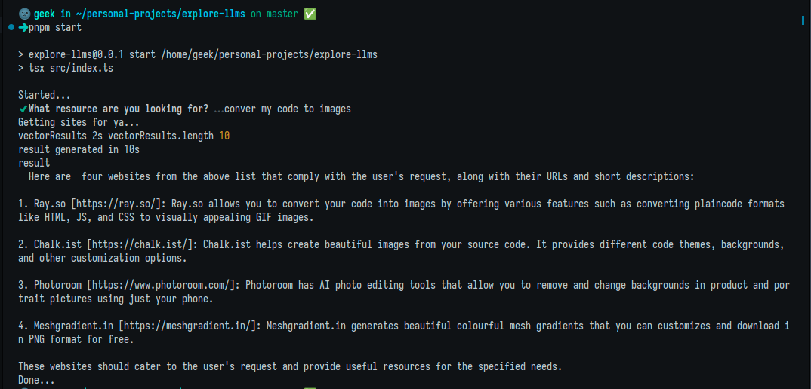

## explore-llms

Just exploring gpt and shit

The goal here is to make an assistant that can find websites for people's described use case from my bookmarks.

Sample -


> [!WARNING]
> This is outdated, have added other stuff no time to docs

### Setup

- You need to get [cohere](https://cohere.com/) api key & setup a [upstash](https://upstash.com/) vector db

  then put their keys in `.env` file, a [sample](sample.env) is given

  I am using cohere trial api key so no cost for it and upstash has a good enough free tier for my use.

- Install the deps

  ```
  pnpm i # install deps
  ```

### Generating a dataset & running

- Get your bookmarks or use my bookmarks json [./sample/bookmarks.html](sample/bookmarks.html)

  Save the bookmarks at root with filename `./bookmarks.html`

- Now you generate the dataset

  ```
  pnpm generate
  ```

  This will parse bookmarks file & run puppeteer and grab title & meta for all bookmarks

  This data will be put in `./dataset.json` ([sample](sample/dataset.json)) and then put in vector db when running

- Now put the dataset in the vector db

  ```
  pnpm syncDataset
  ```

- And now you can run the main process and give a prompt
  ```
  pnpm dev
  ```
